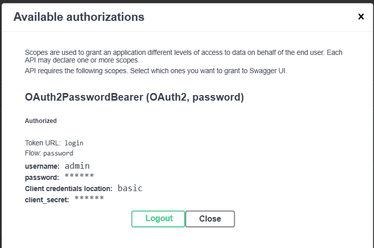
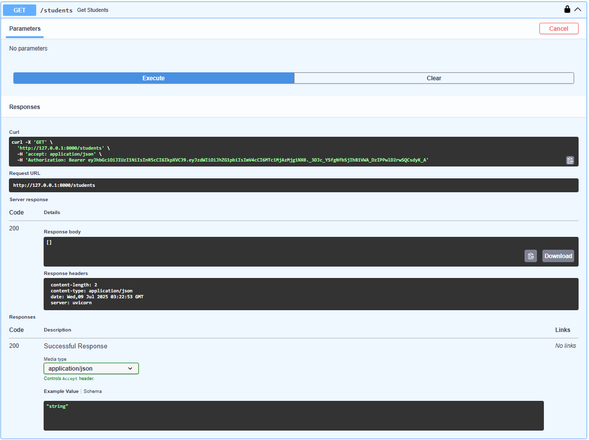
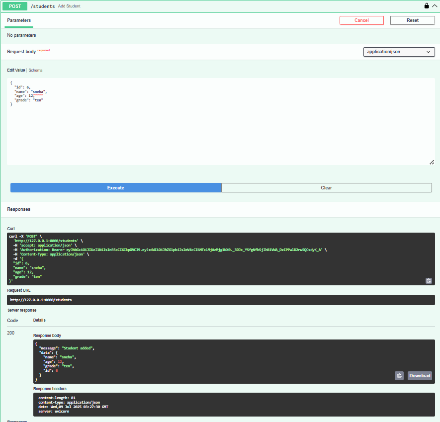
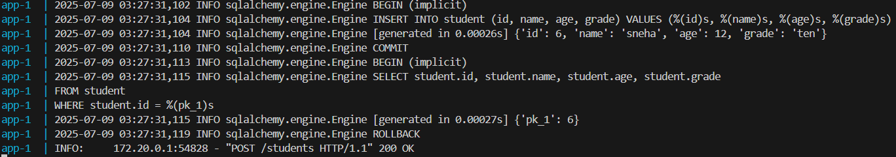

# College Management Web (Backend API)

**Author:** Sneha Mahat  
**GitHub Repo:** [College-Management-web](https://github.com/snehamahat211/College-Management-web)  
**Elective Subject:** Web Services  
**Semester:** Sixth (6th)  
**Department:** BE Software Engineering  
**Roll No:** 221742

---
## 1.Introduction

This project is a backend API for a College Management System built using **FastAPI**. It allows authorized users to perform CRUD operations on student data via RESTful APIs. The project uses **JWT-based authentication**, **PostgreSQL** as the relational database, and **Docker** for containerization.

---

## 2. Objectives

- Build a secure and lightweight backend API.
- Authenticate users using **JWT tokens** via `/login` route.
- Store and manage student data.
- Use **SQLAlchemy / SQLModel** as ORM for PostgreSQL.
- Host the API and DB using **Docker Compose**.
- Auto-generate API documentation with **Swagger UI**.

---

## 3. How to Run the Project

### Prerequisites

- Docker
- Docker Compose

### 4. Clone the Repository

 'git clone https://github.com/snehamahat211/College-Management-web.git'
 'cd College-Management-web'

### -Accessing Services API Documentation:

`http://localhost:8000/docs`

### -Running with Docker

 docker-compose up --build

To check logs:

 docker-compose logs -f

## Tech Stack
Backend Framework: FastAPI

Database: PostgreSQL

ORM: SQLAlchemy / SQLModel

Authentication: JWT (with password hashing)

API Docs: Swagger (FastAPI docs)

Containerization: Docker + Docker Compose

## Outputs
#### 1.

#### 2. 

#### 3. 

###4.

